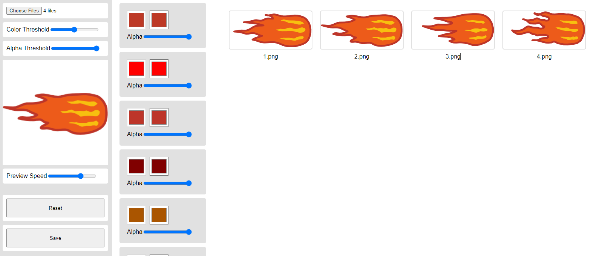

# Sprite Color Changer

**Access here**: https://fleeasura123.github.io/spritecolorchanger/



## File Input

- **Type** - png or jpeg image
- **Filename Format** - {Sprite Number}.png, for example, 1.png

## Controls
- **Color Threshold** - this option means that, for example, we have 2 different brown colors **(color1 & color2)** in our sprite, but they are almost the same, color threshold will check if these colors have the same threshold based on our **color threshold value**. If the 2 different brown colors have the same threshold, once we change color1 it will also change color2 with the same color we picked. Therefore, the higher the color threshold the lesser the colors need to change.
- **Alpha Threshold** - if we are computing color threshold, alpha is included in the computation, if alpha is **below the alpha threshold**, we will not include the alpha in the computation. Therefore, color threshold will compute only **RGB** of color1 and color2, for example, we have color1 ```rgba(1,1,1,255)``` and color2 ```rgba(1,1,1,10)``` and our alpha threshold is **255**, output will be the same color threshold because we did not include color2 alpha in the computation because it is not in the alpha threshold. If our alpha threshold is **1**, we will include color2 alpha in the computation and the output will be not in the same threshold (but the output will also based on the color threshold).
- **Preview Speed** - speed of animating the sprites.
- **Reset** - back to start after the uploading of images/sprites.
- **Save** - save the updated sprites, output will be on **output.zip output folder**.
- **Alpha on Color** - will change the alpha of the color. If color1 alpha is 255 and color2 alpha is 100 and these 2 colors have the same color threshold, once we change the alpha of color1 it will also change the alpha of color2. Therefore, they will have the same alpha, for example, 50 alpha, but we can't go back to 255 and 100 alpha.

## Demo
https://www.youtube.com/watch?v=Z2zbbqkR9vw
[](http://www.youtube.com/watch?v=Z2zbbqkR9vw "Sprite Color Changer (Demo)")

## Libraries
- **JSZip** (https://stuk.github.io/jszip/) - for zipping the output because browsers have a limit of files for simultaneous download.
